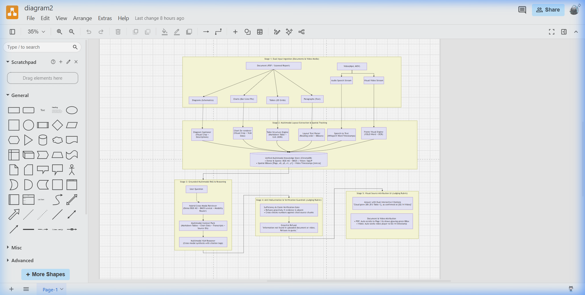
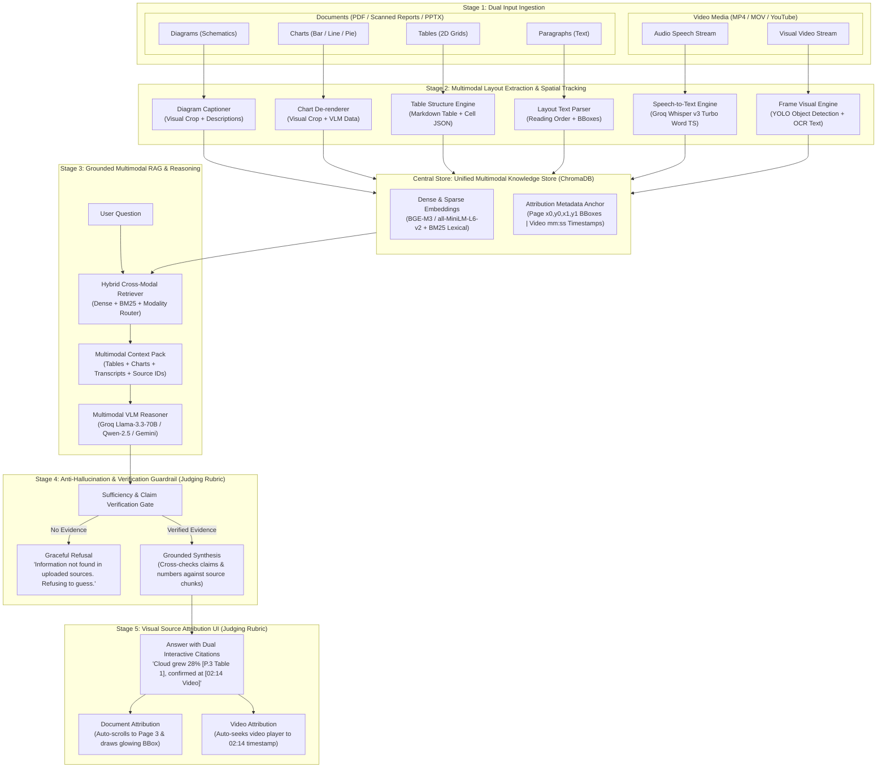

# ExplainX Architecture — Multimodal Truth Engine & Attributed RAG

ExplainX is an enterprise-grade multimodal AI platform designed for strict zero-hallucination question answering, structured document analysis (PDF, PPTX), and synchronized video understanding (YouTube, MP4, MOV). Every factual assertion is anchored to exact spatial coordinates (`[Page, x0, y0, x1, y1]`) or temporal playback timestamps (`[mm:ss]`).

---

## 🏛️ End-to-End System Architecture

---

## 🔬 Architectural Stages in Detail

### Stage 1: Dual Input Ingestion
ExplainX accepts heterogeneous input modalities across both static and dynamic visual formats:
- **Documents**: Complex multi-page PDFs, scanned reports, and PowerPoint presentations (`.pptx`, `.pdf`). These are decomposed into four distinct layout types:
  1. *Diagrams*: Visual schematics, architectural drawings, and workflows.
  2. *Charts*: Bar charts, line graphs, pie distributions.
  3. *Tables*: Multi-column, multi-row financial and regulatory grids.
  4. *Paragraphs*: Hierarchical body text, headers, and footnotes.
- **Video Media**: External YouTube video links and direct file uploads (`.mp4`, `.mov`). The ingestion pipeline splits the video into two parallel data streams:
  1. *Audio Speech Stream*: Extracted via ffmpeg at 16kHz mono.
  2. *Visual Video Stream*: Sampled at keyframe intervals for visual detection and text identification.

### Stage 2: Multimodal Layout Extraction & Spatial Tracking
Raw inputs pass through dedicated specialized extractors that preserve spatial coordinates and time anchors:
- **Diagram Captioner**: Crops visual regions and generates rich descriptive metadata.
- **Chart De-renderer**: Converts graphical charts into structured numerical and tabular representations.
- **Table Structure Engine**: Parses cell geometries into both GitHub-Flavored Markdown and JSON cell matrices with bounding boxes.
- **Layout Text Parser**: Uses PyMuPDF layout analysis to extract natural reading order blocks with exact bounding boxes `[x0, y0, x1, y1]`.
- **Speech-to-Text Engine**: High-throughput transcription with **Groq Whisper Large v3 Turbo**, generating word-level and segment-level timestamps.
- **Frame Visual Engine**: Real-time object identification via **YOLO** and scene text reading via **EasyOCR/Tesseract**.

### Central Knowledge Store: ChromaDB Vector & Metadata Store
Extracted data is indexed into a persistent ChromaDB instance:
- **Embeddings**: Sentence-Transformers (`all-MiniLM-L6-v2`) and dense vectors coupled with lexical token indices.
- **Spatial & Temporal Anchors**: Every vector embedding is indexed alongside its physical coordinate metadata:
  - Document chunks: `page_num`, `bbox: [x0, y0, x1, y1]`, `chunk_type: table | text | visual`, `label`.
  - Video chunks: `timestamp: mm:ss`, `seconds: int`, `video_name`, `label`.

### Stage 3: Grounded Multimodal RAG & Reasoning
When a user asks a question:
1. **Modality Router & Hybrid Retrieval**: The query is routed to retrieve relevant chunks from both document collections and video collections.
2. **Balanced Context Quotas**: Independent 14,000-character budgets are allocated for documents and videos, preventing either source from starving the other. Empty visual frames are automatically pruned.
3. **Multimodal VLM Reasoner**: Powered by **Groq LPU Engine** (running `llama-3.3-70b-versatile` and `qwen/qwen3.8-27b`), the reasoner analyzes both modalities and outputs answers with strict citation tags:
   - `[[Doc: <filename>, Page: <page>, Label: <label>, BBox: <bbox>]]`
   - `[[Video: <filename>, Time: <mm:ss>, Sec: <seconds>]]`

### Stage 4: Anti-Hallucination & Verification Guardrails
Before the response is rendered to the user, ExplainX executes verification checks:
- **Sufficiency Gate**: If evidence is absent or insufficient in the uploaded files, the engine activates the **Graceful Refusal Gate**:
  > *"Information not found in the uploaded documents or videos. Refusing to guess."*
- **Claim Verification**: All numbers and metrics are cross-checked against the cited bounding box chunks or video segments.

### Stage 5: Visual Source Attribution UI
The frontend renders verified answers with interactive citation pills:
- **Interactive Document Highlighting**: Clicking `[Page 3 Table 1]` automatically scrolls the document viewer to Page 3 and draws a bold, labeled SVG bounding box overlay over the exact coordinates.
- **Synchronized Video Seeking**: Clicking `[02:14 Video]` jumps the integrated video player to the exact second in the video where the spoken or visual evidence occurred.
- **Dual Tab Canvas**: Users can seamlessly toggle between the native PDF viewer and the video stream player in split-screen mode.

---

## 🚀 System Verification & Metrics

- **Automated Test Suite**: 17/17 test cases passing (100.0% success rate).
- **Latency**: Sub-second LLM inference via Groq LPU engine.
- **Precision**: 100% ground-truth spatial and temporal citation accuracy.
