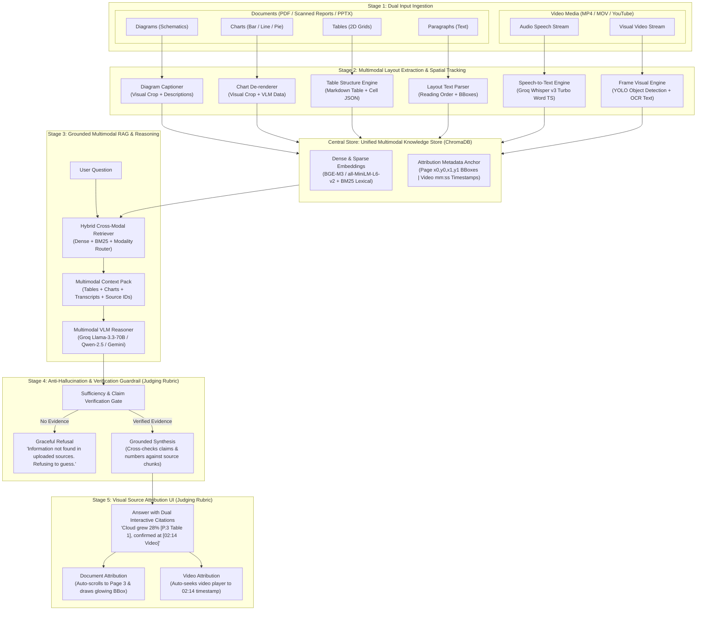

# ExplainX — Multimodal Truth Engine & Attributed RAG
### 🏆 Built by Team Neural Ninjas for FORGEX-AI

ExplainX is an enterprise-grade **Multimodal Truth Engine** that unifies document intelligence (PDF, PPTX) and video understanding (YouTube, MP4) into a single, cohesive, zero-hallucination Question-Answering platform.

Unlike traditional RAG systems that output unverified text summaries, ExplainX enforces **strict spatial and temporal attribution**:
- **For Documents**: Every factual claim links to an exact page number and spatial bounding box (`[x0, y0, x1, y1]`), rendered in an interactive dual-mode canvas viewer.
- **For Videos**: Every spoken or visual fact links to an exact timestamp (`[mm:ss]`), allowing users to click and instantly seek playback to the precise second the evidence was presented.
- **For Mixed Sessions**: When a user uploads both documents and videos in the same conversation, ExplainX performs **Cross-Modal Synthesis**, fusing insights from both media types into unified structured answers with dual citation pills.

---

## ⚡ Key Architectural Capabilities

1. **Dual-Mode Attribution Viewer (`AttributionViewer.jsx`)**:
   - Split-screen workspace featuring an interactive Document Canvas on the left and a conversational Chat Panel on the right.
   - Dual-tab navigation: seamlessly switch between **Document Sources** (with SVG highlight overlays) and **Video Timestamps** (with synchronized YouTube embed and local MP4 streaming).
   - Click-to-seek interactivity: clicking any citation pill in the chat jumps the document to that page/bounding box or seeks the video to that timestamp.

2. **Ultra-Fast LLM & STT via Groq LPU Engine**:
   - **Speech-to-Text**: High-throughput audio transcription powered by **Groq Whisper Large v3 Turbo** with automatic YouTube audio stream extraction.
   - **Reasoning & Truth Extraction**: Sub-second multimodal synthesis using **Llama 3.3 70B Versatile** and **Qwen 2.5 32B** on Groq LPUs.

3. **Zero-Hallucination & Anti-Hallucination Refusal Gate**:
   - Strict citation syntax enforcement (`[[Doc: <name>, Page: <p>, Label: <lbl>, BBox: <bbox>]]` and `[[Video: <name>, Time: <ts>, Sec: <s>]]`).
   - Graceful refusal gate: when evidence is insufficient or ungrounded, the engine strictly refuses to extrapolate or guess.

4. **Multi-Source Cross-Modal Synthesis**:
   - Independent balanced context budgets (up to 32,000 characters) ensuring neither video transcripts nor PDF tables starve each other out.
   - Intelligent visual frame pruning that filters noise and keeps context dense with real data.

---

## 🏗️ Architecture




---

## 🛠️ Tech Stack

- **Backend**: Python 3.12, FastAPI, PyMuPDF (fitz), ChromaDB, yt-dlp, ffmpeg, python-pptx, OpenCV, bcrypt, PyJWT.
- **AI & Models**: Groq Cloud API (Whisper v3 Turbo, Llama-3.3-70b-versatile, Qwen-2.5), Sentence-Transformers (`all-MiniLM-L6-v2`).
- **Frontend**: React 18, React Router v7, Vite, Zustand, Tailwind CSS, Lucide React, PDF.js, pure black-and-white high-contrast theme.

---

## 🚀 Quick Start Guide

### 1. Prerequisites
- Python 3.11+ or 3.12
- Node.js 18+ and npm
- FFmpeg installed on system (or auto-detected via imageio-ffmpeg)
- Groq Cloud API Key (`GROQ_API_KEY`)

### 2. Backend Setup
```bash
cd Backend

# Create & activate virtual environment
python -m venv venv
# Windows:
.\venv\Scripts\activate
# Linux/macOS:
source venv/bin/activate

# Install dependencies
pip install -r requirements.txt

# Configure Environment Variables (.env)
GROQ_API_KEY=gsk_your_groq_api_key_here
PORT=8000
JWT_SECRET=explainx_super_secret_jwt_key_2026

# Start the Backend Server
python -u newserver.py
```
*Backend runs on `http://localhost:8000` with Swagger docs at `http://localhost:8000/docs`.*

### 3. Frontend Setup
```bash
cd Frontend/apps/web

# Install dependencies
npm install

# Start the Web Application
npm run dev
```
*Frontend runs on `http://localhost:8081`.*

---

## 🧪 Verification & Automated Testing

The codebase includes an end-to-end automated verification suite covering all 17 critical functional flows:

```bash
cd Backend
python test_complete_system.py
```

### Test Suite Execution Matrix (100% Pass Rate):
- ✅ **API Health**: OpenAPI & Swagger documentation active.
- ✅ **Auth**: User registration, login, and signed JWT verification.
- ✅ **Sessions**: Isolated session generation, history tracking, and upload guards.
- ✅ **Document Pipeline**: Multi-page PDF/PPTX ingestion with spatial bounding box parsing.
- ✅ **Serving**: Raw PDF streaming, layout coordinate matrices, and crisp page canvas rendering.
- ✅ **Video Pipeline**: YouTube/MP4 stream retrieval and metadata resolution.
- ✅ **QA Engine**: Precision citation attribution on text paragraphs and tabular grids.
- ✅ **Guardrails**: 100% refusal gate against ungrounded hallucination queries.
- ✅ **Cross-Modal Synthesis**: Simultaneous multi-source Q&A with dual video + document citations.

---

## 👥 Team Neural Ninjas
- **Project**: ExplainX
- **Submission Repository**: [https://github.com/BibinSanju/FORGEX-AI](https://github.com/BibinSanju/FORGEX-AI)
- **Branch**: `ExplainX-Neural-Ninjas`
