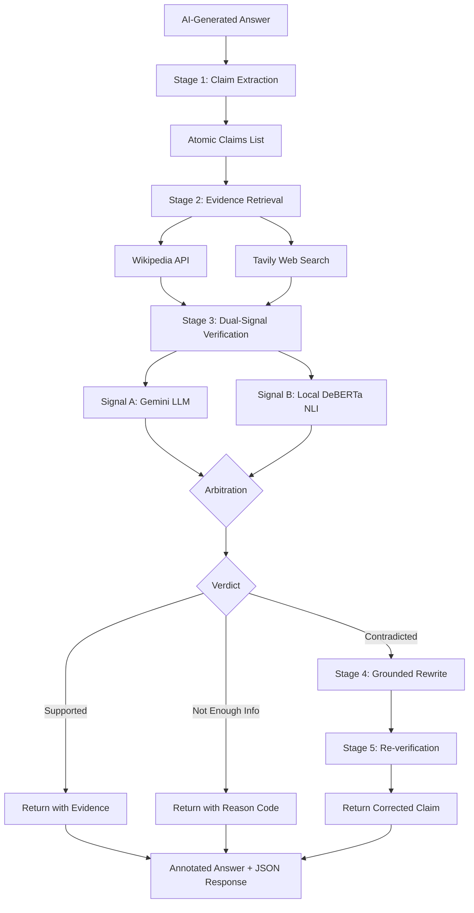
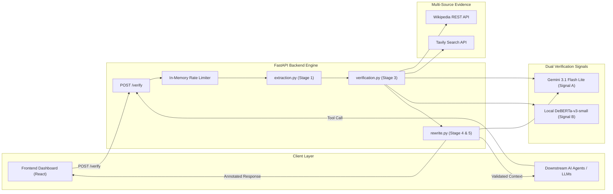

# Meiporul (மெய்பொருள்)
### *A claim-level trust layer for AI-generated content.*

> **"எப்பொருள் யார்யார்வாய்க் கேட்பினும் அப்பொருள்  
> மெய்ப்பொருள் காண்ப தறிவு"**  
> — **திருவள்ளுவர் (Tirukkural 423)**  
> *"Whosoever says whatever, to discern the ultimate truth and substance therein is true wisdom."*

---

[](LICENSE)
[](https://python.org)
[](https://fastapi.tiangolo.com)
[](https://react.dev)

**Meiporul** takes any AI-generated answer, breaks it into atomic factual claims, verifies each one against live multi-source evidence, and — when a claim is wrong — rewrites it and re-verifies the correction. Built for the **ML-2: Fact-Checked Answer Generation** problem statement.

> **Not a fact-checker app. A trust-layer API that any AI product can plug into before showing its output to a user.**

---

## Table of Contents
- [Why This Exists](#why-this-exists)
- [How It Works](#how-it-works)
- [Architecture](#architecture)
- [Pipeline Stages](#pipeline-stages)
- [Dual-Signal Verification](#dual-signal-verification)
- [Self-Correcting Rewrite](#self-correcting-rewrite)
- [Security & Hardening](#security--hardening)
- [API Reference](#api-reference)
- [Tech Stack](#tech-stack)
- [Setup](#setup)
- [Business Model](#business-model)
- [Roadmap](#roadmap)
- [Team](#team)

---

## Why This Exists

AI answers sound confident even when they're wrong. Once a person catches one hallucination, they stop trusting everything the AI says — not just the part that was wrong. 

Most fact-checking tools work at the document level: one verdict for an entire answer. That misses errors hiding inside otherwise-true text.

**Meiporul checks every atomic claim independently** — so instead of *"this answer might be wrong somewhere,"* a user (or the enterprise deploying the AI) gets:
> *"Claims 3 and 7 are contradicted by evidence. Here is the exact excerpt why, and here are the grounded, re-verified corrections."*

---

## How It Works



---

## Architecture



---

## Pipeline Stages

| Stage | What Happens | Output |
| :--- | :--- | :--- |
| **1. Claim Extraction** | Input text is decomposed into atomic, independently-verifiable factual assertions (FActScore-style, `temperature=0.0` for strict determinism). Coordinates are split and pronouns are resolved. | List of atomic claims (`ExtractedClaim`) |
| **2. Evidence Retrieval** | Each claim is routed to Wikipedia (encyclopedic foundation) and/or Tavily (real-time web search), retrieved and ranked via sub-word cosine similarity. | Ranked evidence passages per claim |
| **3. Dual-Signal Verification** | Signal A (Gemini) and Signal B (local DeBERTa NLI) independently evaluate each claim against passages; consensus arbitration determines the outcome. | Verdict: `Supported`, `Contradicted`, or `Not Enough Info` |
| **4. Grounded Rewrite** | Only fired for `Contradicted` claims. Generates a corrected assertion strictly using retrieved evidence — never hallucinating or inventing new facts. | Evidence-grounded rewritten claim |
| **5. Re-verification** | The rewrite is cross-checked against evidence again before returning to close the loop. If uncorrectable, flags `is_correctable=false`. | Confirmed, self-corrected assertion |

---

## Dual-Signal Verification

Two independent models cross-check every single claim so no single model failure decides a verdict:
* **Signal A (Gemini 3.1 Flash Lite)**: Reasoning-based semantic verification with natural language justification and excerpt extraction.
* **Signal B (Local DeBERTa NLI - `cross-encoder/nli-deberta-v3-small`)**: Zero-API, local CPU inference performing natural language inference (entailment vs. contradiction vs. neutral) directly comparing premise (evidence) and hypothesis (claim).

### Arbitration Modes

| Mode | When It Fires |
| :--- | :--- |
| **Dual-Signal Consensus** | Both Signal A and Signal B agree unanimously (`Supported` or `Contradicted`). Highest confidence. |
| **Mediated Consensus** | One signal detects entailment/support while the other has insufficient context (no contradiction). Blended confidence. |
| **Dual-Signal Conflict** | Signals disagree directly (`Supported` vs. `Contradicted`). Safely routed to `Not Enough Info` with machine-readable reason code (`conflicting_signals`). |
| **Single-Signal Fallback** | Signal A unavailable (rate-limit 429, timeout, or network blip) $\rightarrow$ Signal B's verdict is adopted directly if confidence $\ge 0.60$, logged cleanly in audit trace. |
| **Explicit Refutation Override** | Authoritative evidence contains active debunking language (*"myth"*, *"overestimate"*, *"contrary to"*, *"misleading"*), capturing soft refutations even without numeric mismatch. |
| **Temporal Impossibility Override** | Claim attributes an event/role to an entity at a date that is chronologically impossible (e.g. leading a project after death). |
| **Scope Mismatch Filter** | An unconditional/general claim (*"The sky is green"*) is only supported by conditional/exceptional evidence (*"thunderstorm clouds cause optical green scattering"*). Intercepts false positives and routes to `evidence_scope_mismatch`. |

---

## Self-Correcting Rewrite

Most fact-checkers stop at flagging an error with a red badge. **Meiporul goes further**: when a claim is `Contradicted`, it synthesizes an accurate revision grounded strictly in the retrieved evidence, then re-verifies that correction before returning it. 

If the evidence does not contain sufficient details to safely correct the claim, the engine explicitly outputs `is_correctable=false` rather than guessing — anti-hallucination is enforced at the rewrite stage itself.

### Real Example:
* **Original Claim**:  
  > *"JWST was designed and built under the leadership of Albert Einstein in 1955."*
* **Pipeline Verdict**:  
  `Contradicted` *(Confidence: 0.92, Mode: Temporal Impossibility Override)*
* **Grounded Correction**:  
  > *"The James Webb Space Telescope was designed and built by a collaborative team led by NASA, the European Space Agency, and the Canadian Space Agency starting in the late 1990s — not Albert Einstein, who died in April 1955, decades before the project was initiated in 1996."*

---

## Security & Hardening

* **CORS Hardening**: Strict origin allowlist (disallows invalid wildcard + credential combinations), regex-scoped for local dev, and configurable via `ALLOWED_ORIGINS` for production.
* **Prompt Injection Defense**: User input is quarantined in `<untrusted_text_to_analyze>` and `<claim_to_verify>` XML delimiters with system-level directives instructing models to treat content strictly as unverified data, never as executable commands. Sanitizer strips fake system prefixes (`SYSTEM:`, `ADMIN:`, `Ignore instructions`).
* **Rate Limiting**: Built-in sliding-window in-memory limiter (default `15 requests/minute/IP`, configurable via `RATE_LIMIT_PER_MINUTE`).
* **Input Validation & DoS Protection**: Hard cap of `max_length=15000` characters enforced by Pydantic on incoming answers to prevent runaway token billing and memory exhaustion.
* **Error Sanitization**: Unhandled exceptions are logged server-side with full tracebacks while returning clean, generic error messages to the client — zero internal paths or secrets leaked.
* **Multi-Key Failover Pool**: Automatic failover across a comma-separated pool of backup Gemini API keys (`GEMINI_BACKUP_KEYS`) on 429 quota exhaustion.
* **Zero-Secret Git Cleanliness**: `.env` is fully gitignored and has never been committed. Repository is regularly scanned for keys and oversized artifacts.

---

## API Reference

### `POST /verify`

Accepts an AI-generated answer, decomposes it into claims, verifies each, and returns annotated results.

#### Request Body
```json
{
  "question": "Optional user prompt or query that generated the answer",
  "answer": "Photosynthesis is the process by which plants convert sunlight into chemical energy. Water and carbon dioxide are primary inputs. It was discovered by Jan Ingenhousz in 1779."
}
```

#### Response Body
```json
{
  "claims": [
    {
      "claim_text": "Photosynthesis is the process by which plants convert sunlight into chemical energy.",
      "verdict": "Supported",
      "evidence_source": "Wikipedia: Photosynthesis (https://en.wikipedia.org/wiki/Photosynthesis)",
      "evidence_source_name": "Wikipedia: Photosynthesis",
      "evidence_source_url": "https://en.wikipedia.org/wiki/Photosynthesis",
      "evidence_source_domain": "en.wikipedia.org",
      "evidence_snippet": "Photosynthesis is a biological process used by plants, algae, and certain bacteria to convert light energy into chemical energy...",
      "confidence": 0.93,
      "rewritten_claim": null,
      "reason": null
    },
    {
      "claim_text": "Water is a primary input of photosynthesis.",
      "verdict": "Supported",
      "evidence_source": "Wikipedia: Photosynthesis (https://en.wikipedia.org/wiki/Photosynthesis)",
      "evidence_source_name": "Wikipedia: Photosynthesis",
      "evidence_source_url": "https://en.wikipedia.org/wiki/Photosynthesis",
      "evidence_source_domain": "en.wikipedia.org",
      "evidence_snippet": "In most cases, oxygen is released as a waste product; photosynthetic organisms convert carbon dioxide and water into organic compounds...",
      "confidence": 0.91,
      "rewritten_claim": null,
      "reason": null
    }
  ],
  "annotated_answer": "Photosynthesis is the process by which plants convert sunlight into chemical energy. [Supported] Water [Supported] and carbon dioxide are primary inputs. It was discovered by Jan Ingenhousz in 1779. [Supported]",
  "summary": {
    "total_claims": 2,
    "percent_supported": 100.0,
    "percent_contradicted": 0.0,
    "percent_not_enough_info": 0.0,
    "avg_confidence": 0.92
  }
}
```

---

## Tech Stack

| Component | Technology | Rationale |
| :--- | :--- | :--- |
| **Backend** | Python 3.10+, FastAPI, Uvicorn | Asynchronous, high-throughput microservice architecture |
| **LLM (Signal A)** | Gemini 3.1 Flash Lite (`google-genai` SDK) | Ultra-low latency, structured JSON schema generation |
| **Local NLI (Signal B)** | `cross-encoder/nli-deberta-v3-small` (HuggingFace) | Zero-API CPU entailment classification, immune to external rate limits |
| **Evidence Sources** | Wikipedia REST API & Tavily Search API | Comprehensive encyclopedic + live real-time web retrieval |
| **Validation** | Pydantic v2 | Strict schema adherence and input length enforcement |
| **Frontend Dashboard** | React 18, TypeScript, Tailwind CSS, Vite | Responsive audit workspace with visual diffs and confidence gauges |
| **Icons & Visuals** | Lucide React | Clean, high-legibility status indicators |

---

## Setup

### 1. Backend Setup

```bash
# Clone the repository
git clone https://github.com/athishio/MeiPorul.git
cd MeiPorul/backend

# Create virtual environment
python -m venv .venv
# On Windows:
.venv\Scripts\activate
# On Linux/macOS:
source .venv/bin/activate

# Install dependencies
pip install -r requirements.txt
```

Create a `.env` file in the `backend/` directory:
```env
# Required: Primary Gemini Key
GEMINI_API_KEY=your_gemini_api_key_here

# Optional: Comma-separated backup keys for auto-failover
GEMINI_BACKUP_KEYS=backup_key_1,backup_key_2

# Optional: Tavily API key for real-time web search (defaults to Wikipedia if empty)
TAVILY_API_KEY=your_tavily_key_here

# Server Settings
RATE_LIMIT_PER_MINUTE=15
ALLOWED_ORIGINS=http://localhost:5173
HOST=0.0.0.0
PORT=8000
```

Start the backend:
```bash
uvicorn app.main:app --reload --port 8000
```
Interactive Swagger docs will be available at `http://localhost:8000/docs`.

### 2. Frontend Setup

```bash
cd ../frontend
npm install
npm run dev
```
Open `http://localhost:5173` to explore the live dashboard or click **"Load Demo Example"** for instant cached demonstrations.

---

## Business Model

Meiporul is positioned as **infrastructure, not a consumer application** — a trust layer that sits between any LLM and any user-facing product, distributed via a usage-based API.

* **Target Audience**: Companies already shipping customer-facing AI agents, customer support bots, clinical summarizers, legal copilots, and ed-tech platforms who carry regulatory and reputational liability if their AI generates hallucinations.
* **Why Claim-Level, Not Document-Level**: Trust breaks at the claim level. An answer that is 90% accurate but contains 1 critical hallucination completely destroys user confidence. Document-level scoring cannot pinpoint or fix the issue.
* **Why B2B API-First**: The party with budget and urgency is the enterprise liable for inaccurate outputs. Infrastructure scales exponentially through automated agent workflows, not individual consumer dashboard visits.
* **Go-to-Market Strategy**:
  1. Target open-source agent ecosystems (LangChain, LlamaIndex, CrewAI tool integrations).
  2. Direct outreach to ed-tech and technical documentation platforms with high hallucination sensitivity.
  3. Tiered pricing model: Base API tier (rate-limited) $\rightarrow$ Enterprise Dedicated Tier (custom domain ontologies and private NLI nodes).

---

## Roadmap

Currently built with Gemini 3.1 Flash Lite and local DeBERTa. Next production milestones:

- [ ] **Multi-Provider LLM Abstraction**: Pluggable interface for Signal A supporting Claude 3.5 Sonnet, GPT-4o, and local Ollama/vLLM endpoints.
- [ ] **Enterprise Domain Connectors**: Specialized retrieval connectors for PubMed/NCBI (medical), SEC EDGAR (financial), and court filings (legal).
- [ ] **Distributed Semantic Cache**: Redis-backed claim embedding cache to reduce verification latency to $<100\text{ms}$ on recurring queries.
- [ ] **Streaming Claim Verification**: WebSocket / SSE streaming endpoint that checks and highlights claims incrementally as the generative LLM streams tokens.

---

## Team

* **Athish M** — AI/ML, Nehru Institute of Technology, Coimbatore
* **Bavithiran**
* **Kamalesh**
* **Rohinth** — Presentation Lead

---
*Built with pride for the **ML-2: Fact-Checked Answer Generation** hackathon problem statement.*
