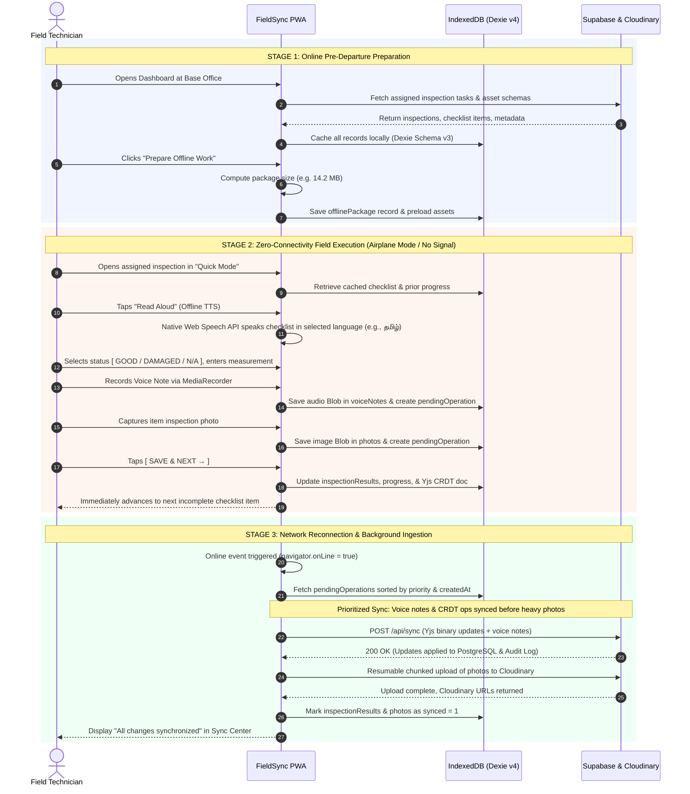
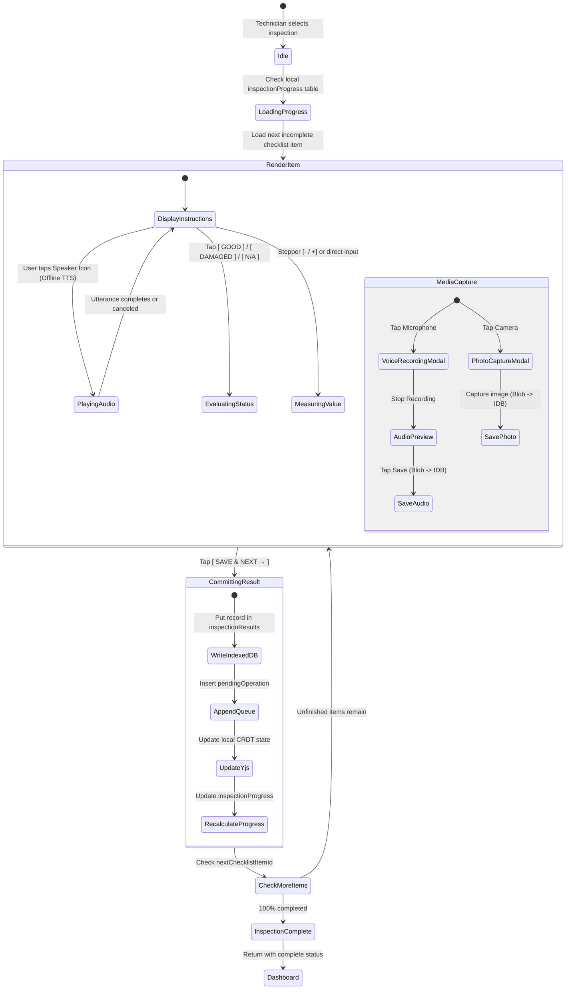
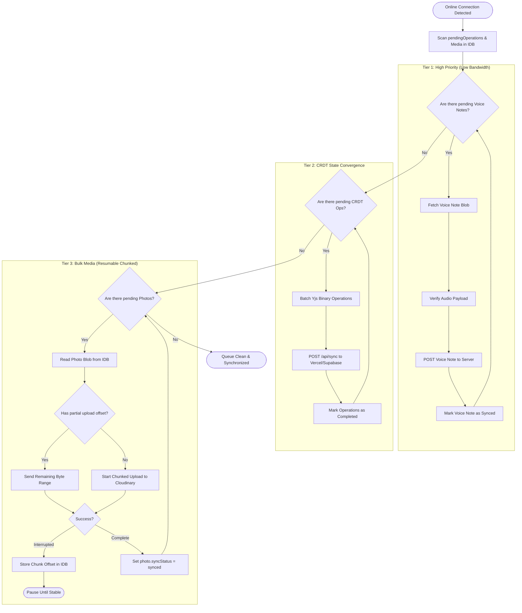
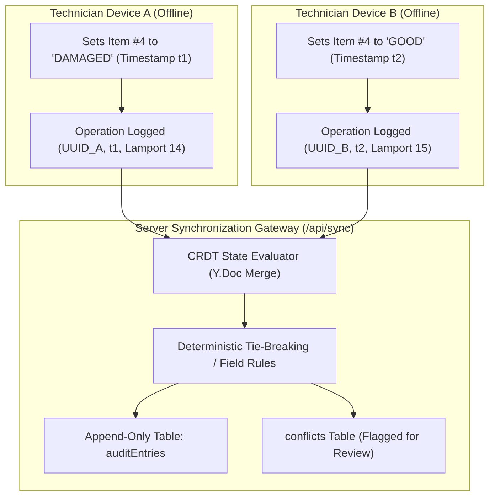
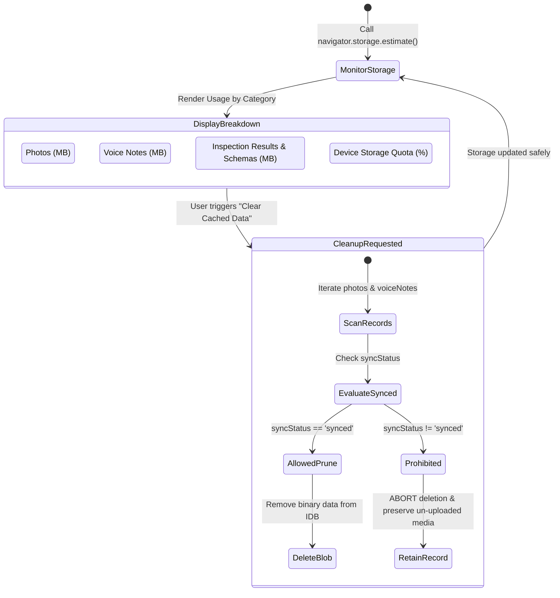

# FieldSync — Operational Workflows & System State Machines

This document outlines the detailed architectural, operational, and lifecycle workflows governing the **FieldSync** offline productivity and synchronization engine.

---

## 1. End-to-End Technician Field Workflow

The diagram below illustrates the operational lifecycle of a field technician moving from online preparation at headquarters, transitioning to zero-connectivity execution in the field, and returning to network coverage for reconciliation.

---

## 2. Quick Inspection Mode State Machine

The Quick Inspection Mode is engineered for maximum throughput, allowing an inspector to record observations with minimal clicks and immediate visual validation.

---

## 3. Prioritized Asynchronous Media Queue

To avoid congesting weak cellular connections with large image payloads when a device first reconnects, FieldSync enforces strict queue prioritization:

---

## 4. Conflict Resolution & Append-Only Audit Trail

When multiple field workers inspect interrelated assets or parallel components while offline, their states synchronize using **Yjs CRDTs** augmented with an append-only audit trail for administrative transparency:

---

## 5. Storage Guardian & Safe Garbage Collection

